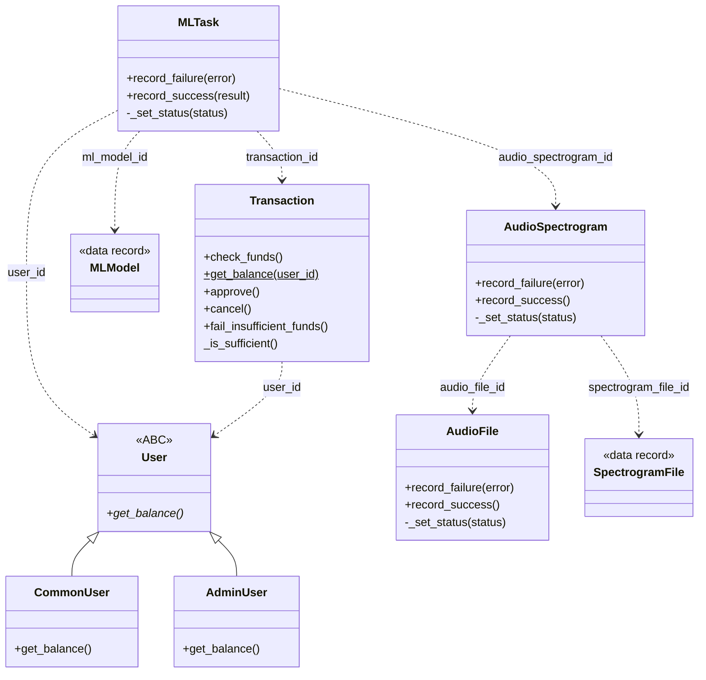
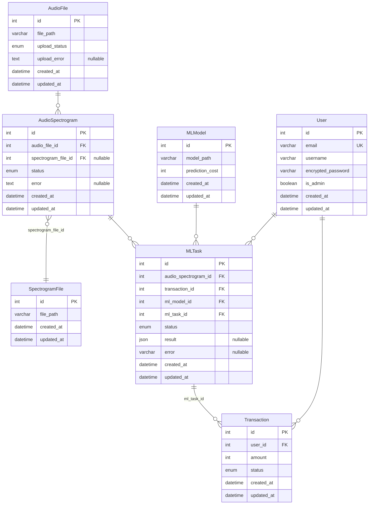

# Music Genre Sommelier AI

## Структура репозитория

Один уровень вложенности (документация и доменный Python — в `docs/` и `app/src/`).

```text
.
├── AGENTS.md # (см .gitignore)
├── README.md
├── docker-compose.yml
├── app/                 # образ приложения: Python, app.py, зависимости
│   └── src/music_genre_sommelier/
│       ├── models/      # модели данных (SQLModel)
│       ├── services/    # сервисный слой (бизнес-логика)
│       └── utils/       # утилиты (БД, enum'ы)
├── db/                  # образ PostgreSQL
├── mb/                  # образ RabbitMQ (management)
├── web-proxy/           # образ nginx (reverse proxy)
└── docs/                # architecture.md, stack.md, drift-check.md, decisions.md (см. .gitignore)
```

## Описание

Классификатор жанров музыкальных произведений на основе спектрограмм.

## Сущности

### Структура классов



### Структура БД

Диаграмма сущностей и связей (контракт совпадает с `docs/architecture.md`).



**Перечисления (ENUM)** — в реальной БД: тип `ENUM(...)` / аналог по СУБД; на диаграмме они обозначены как `enum`.

| Сущность | Поле | Допустимые значения |
|----------|------|---------------------|
| `AudioFile` | `upload_status` | `pending`, `success`, `failure` |
| `AudioSpectrogram` | `status` | `pending`, `success`, `failure` |
| `MLTask` | `status` | `pending`, `success`, `failure` |
| `Transaction` | `status` | `pending`, `fail_insufficient_funds`, `fail_canceled`, `success` |

## Мета-информация

### Использование ИИ-агентов и GPT

- Домашнее задание 1: Агенты не использовались при проектировании, GPT использовался для однократного ревью законченного черновика сущностей (данные и классы). Агент использовался для отрисовки Mermaid диаграм и ведения агентской документации (личные нужды на случай желания продолжать поддерживать проект).
- Домашнее задание 2: Агент использовался для создания блока [Структура проекта](#структура-проекта), GPT использовался для поиска причины несохранения данных после перезапуска контейнера PostgreSQL (образ 18-й версии использует по умолчанию этот путь /var/lib/postgresql/18/docker)
- Домашнее задание 3: Агент использовался для рефакторинга моделей данных — вынос готовой сервисной логики в отдельный слой `services/`, перенос файлов моделей в `models/`.  
