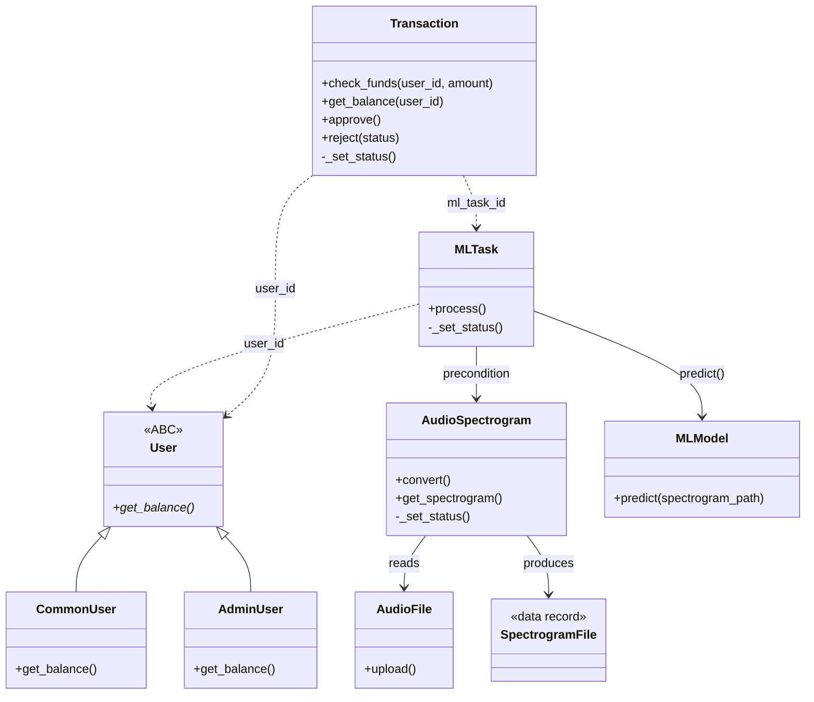
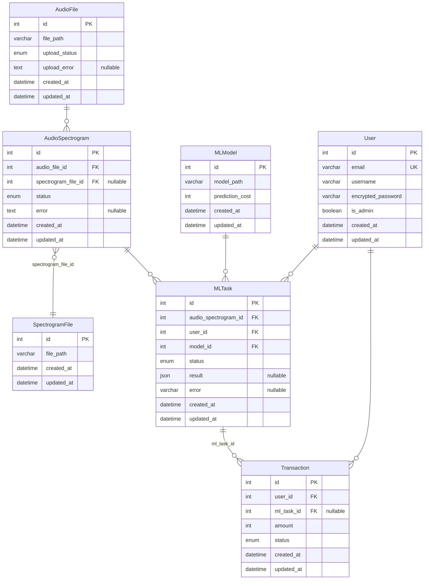

# Music Genre Sommelier AI

## Описание

Классификатор жанров музыкальных произведений на основе спектрограмм.

## Сущности

### Структура классов

> Замечание: `SpectrogramFile` — только запись о файле, без доменной логики (**RULE-05**, `AGENTS.md`). У `AudioSpectrogram`, `MLTask` и `Transaction` префикс `-` в диаграмме — **private** (UML): `_set_status` централизует смену поля **`status`** в БД (у `AudioSpectrogram`, `MLTask` и `Transaction` — разные таблицы; имена колонок совпадают там, где это уместно); вызывать снаружи класса не следует (см. `AGENTS.md`).

### Структура БД

Диаграмма сущностей и связей (контракт совпадает с `docs/architecture.md`).

**Перечисления (ENUM)** — в реальной БД: тип `ENUM(...)` / аналог по СУБД; на диаграмме они обозначены как `enum`.

| Сущность | Поле | Допустимые значения |
|----------|------|---------------------|
| `AudioFile` | `upload_status` | `pending`, `success`, `failure` |
| `AudioSpectrogram` | `status` | `pending`, `success`, `failure` |
| `MLTask` | `status` | `pending`, `success`, `failure` |
| `Transaction` | `status` | `pending`, `fail_insufficient_funds`, `fail_canceled`, `success` |

## Мета-информация

### Использование ИИ-агентов и GPT

- Домашнее задание 1: Агенты не использовались при проектировании, GPT использовался для однократного ревью законченного черновика сущностей (данные и классы). Агент использовался для отрисовки Mermaid диаграм и ведения агентскной документации (личные нужды на случай желания продолжать поддерживать проект).
